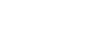

# 郑州大学 VI 标识（SVG 拆分版）

本仓库收录按《郑州大学视觉形象识别系统设计》(VI) 绘制、裁切的矢量标识，包含校徽、中文校名、英文校名以及组合版。全部资源均为可编辑 SVG，便于在网页、印刷或导出位图时复用。

## 目录结构
- `README.md`：项目说明（本文件）。
- `svgs/`：全部标识文件。
  - `icon_logo_*`: 完整组合（校徽+中英文），含 `color` / `black` / `white` 版本。
  - `icon_badge_*`: 仅校徽圆徽，`color` / `black` / `white` 版本，尺寸约 `58×55`。
  - `icon_cn_*`: 仅中文校名，提供 `color_red` / `color_gren`（绿色）/ `black` / `white` 版本。
  - 如需纯英文校名，可根据组合版中的英文部分单独截取或自行着色。
- `pdfs/`：与 `svgs/` 同款的 PDF 矢量文件，适合直接在 LaTeX / Overleaf 中 `\includegraphics{}` 引用。

## LaTeX / PDF 版本
- 所有 PDF 与 SVG 名称一一对应（如 `svgs/icon_logo_color.svg` 对应 `pdfs/icon_logo_color.pdf`）。
- 推荐在 LaTeX 中直接放入 `figure` / `tikz` 环境：

```tex
% 示例：插入彩色组合版
\begin{figure}[h]
  \centering
  \includegraphics[width=0.55\linewidth]{pdfs/icon_logo_color.pdf}
  \caption{Zhengzhou University 标识}
\end{figure}
```

## 快速预览（表格）
| 组合版 | 校徽 | 中文 | 背景 |
| --- | --- | --- | --- |
|  |  |  | 透明 |
|  |  |  | 透明 |
|  |  |  | 建议置于深色背景（预览不显示背景） |

> 注：GitHub 的表格预览不渲染自定义背景色，白色版请在使用时放到深色容器上（示例见下文代码）。

## 视窗与居中
- 拆分版保持各自紧凑的 `viewBox` 以便独立居中使用：
  - 校徽：典型 `viewBox` 约 `0 0 58 58`（见 `icon_badge_*`）。
  - 中文：示例 `viewBox` `60 0 150 55`（`icon_cn.svg`）。
  - 组合：原始横向版 `208×55`（`icon_logo_*`）。

## 颜色与样式
- 颜色直接写在 `fill` 属性中（如 `#800406` 校徽红、`#284345` 深绿、`#000000`、`#FFFFFF`）。
- 需要换色时，可批量替换 `fill` 值；若使用 `class="st0"` 的文件，可改写对应样式块。

## 快速使用示例
```html
<!-- 深色背景示例 -->
<div style="background:#222;padding:16px;display:inline-flex;gap:12px;align-items:center;">
  
  
  
</div>
```

```html
<!-- 浅色背景 + 统一黑色版 -->
<div style="background:#f7f7f7;padding:16px;display:inline-flex;gap:12px;align-items:center;">
  
  
  
</div>
```

```html
<!-- 仅校徽作 favicon / 按钮图标 -->
<link rel="icon" type="image/svg+xml" href="svgs/icon_badge_color.svg" />
<!-- 或缩放嵌入 -->
<button style="padding:8px 12px;display:inline-flex;align-items:center;gap:8px;">
  
  进入郑州大学
</button>
```

## 参考与合规
- VI 手册：<https://www.zzu.edu.cn/wj/xxsbxt.pdf>
- 标识版权归郑州大学所有；使用时请遵守校方 VI 规范与适用版权/商用限制。

## 定制建议
- 导出 PNG／WebP：用矢量工具或浏览器直接导出，按需设置背景透明/纯色。
- 调整留白：修改 `viewBox` 或外层容器的 `padding` 即可。
- 统一配色：在批量场景中优先改写全局 `fill`，保持各文件色值一致。
